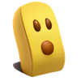
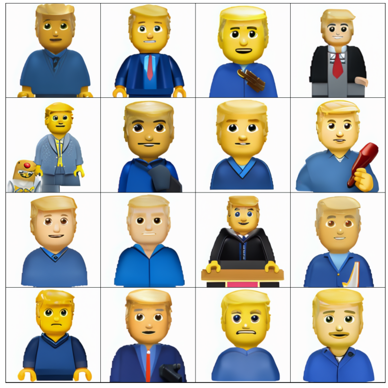
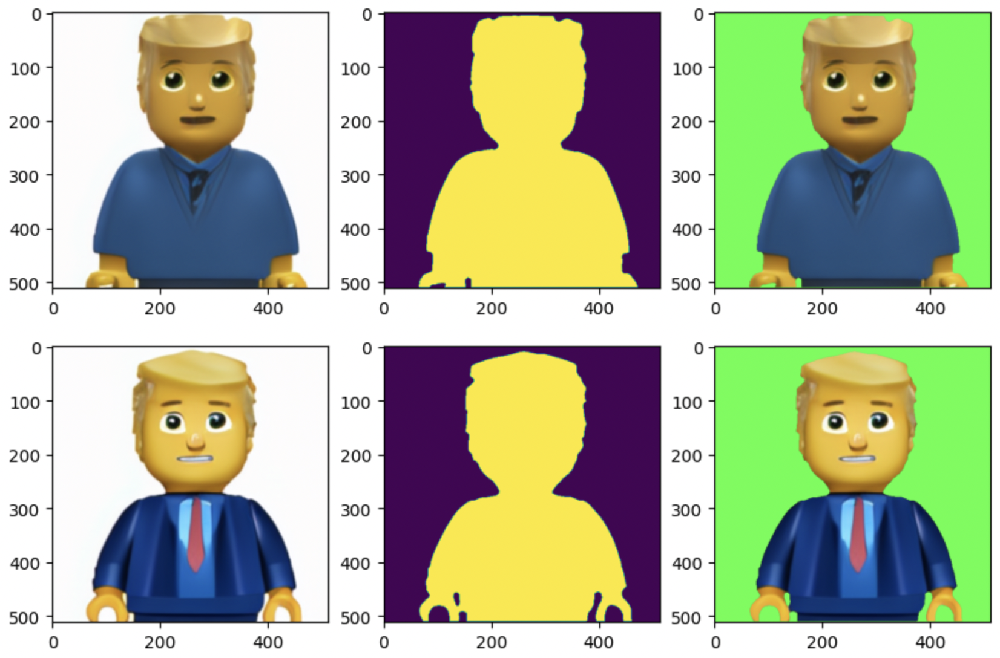

[[Paper]](https://arxiv.org/abs/2112.02448) [[Model Card]](https://huggingface.co/sberbank-ai/rudalle-Emojich) [[Kaggle]](https://www.kaggle.com/shonenkov/emojich-rudall-e) [[Dataset]](https://www.kaggle.com/shonenkov/russian-emoji)
# Emojich

### generate emojis from text

Model was trained by [Sber AI](https://github.com/sberbank-ai)
* Task: `text2image generation`
* Num Parameters: `1.3 B`
* Training Data Volume: `120 million text-image pairs` & [`2749 text-emoji pairs`](https://www.kaggle.com/shonenkov/russian-emoji)

[](https://telegram.me/addstickers/SberAI_ruDALLE)

### Model Description
😋 Emojich is a 1.3 billion params model from the family GPT3-like, it generates emoji-style images with the brain of ◾ Malevich.


### Fine-tuning stage:

The main goal of fine-tuning is trying to keep the generalization of [ruDALL-E Malevich (XL)](https://huggingface.co/sberbank-ai/rudalle-Malevich)
model on text to emoji tasks. ruDALL-E Malevich is a multi-modality big pretrained transformer, that uses images and texts.
The idea with freezing feedforward and self-attention layers in pretrained transformer is demonstrated high performance in changing different modalities.
Also, the model has a good chance for over-fitting text modality and lost generalization.
To deal with this problem is increased coefficient 10^3 in weighted cross-entropy loss for image codebooks part.


Full version of training code is available on Kaggle: [](https://www.kaggle.com/shonenkov/emojich-rudall-e)

### Usage:

[](https://colab.research.google.com/drive/1YbEduCe8jH0DXMXKxnb8ulmT8jscJ54i?usp=sharing)

```python
from rudalle.pipelines import generate_images, show
from rudalle import get_rudalle_model, get_tokenizer, get_vae
from rudalle.utils import seed_everything

device = 'cuda'
dalle = get_rudalle_model('Emojich', pretrained=True, fp16=True, device=device)
tokenizer = get_tokenizer()
vae = get_vae(dwt=True).to(device)

text = 'Дональд Трамп из лего'  # Donald Trump made of LEGO

seed_everything(42)
pil_images = []
for top_k, top_p, images_num in [
    (2048, 0.995, 16),
]:
    pil_images += generate_images(text, tokenizer, dalle, vae, top_k=top_k, images_num=images_num, top_p=top_p, bs=8)[0]

show(pil_images, 4)
```


### Super Resolution:
```python
from rudalle.pipelines import super_resolution
from rudalle import get_realesrgan

device = 'cuda'
realesrgan = get_realesrgan('x4', device=device)
sr_images = super_resolution(pil_images, realesrgan)
```

### Converting to Telegram Stickers format (512x512 RGBA)
```python
from rudalle.pipelines import convert_emoji_to_rgba, show_rgba
from rudalle import get_emojich_unet

device = 'cuda'
emojich_unet = get_emojich_unet('unet_effnetb7').to(device)
rgba_images, _ = convert_emoji_to_rgba(sr_images, emojich_unet,  device=device)
for rgba_image in rgba_images:
    show_rgba(rgba_image);
```


### Examples of generated emojis

All examples are generated automatically (without manual cherry-picking) with hyper-parameters:
seed 42, batch size 16, top-k 2048, top-p 0.995, temperature 1.0, GPU A100.
For making better generative emojis should use more attempts (~512) and select the best one manually.

*Remember, the great art makers became "great" after creating just only one masterpiece.*


### Citation
Feel free to cite our work in your research if it is helpful for you
```
@misc{shonenkov2021emojich,
      title={Emojich -- zero-shot emoji generation using Russian language: a technical report}, 
      author={Alex Shonenkov and Daria Bakshandaeva and Denis Dimitrov and Aleksandr Nikolich},
      year={2021},
      eprint={2112.02448},
      archivePrefix={arXiv},
      primaryClass={cs.CL}
}
```
